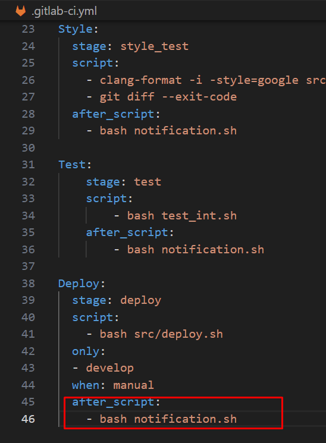
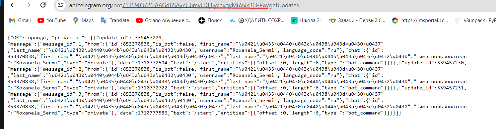

# Basic CI/CD
## Part 1. Настройка gitlab-runner

> docker pull ubuntu

> docker run -it ubuntu

Сначала обновляем, устанавливаем нужные утилиты:

> apt-get update 

> apt-get upgrade 

> apt-get install curl

> apt-get install gcc

> apt-get install make

> apt-get install clang-format

Устанавливаем gitlab-runner:
> curl -L "https://packages.gitlab.com/install/repositories/runner/gitlab-runner/script.deb.sh" | bash

> apt-get install gitlab-runner

* Запусти gitlab-runner и зарегистрируй его для использования в текущем проекте (DO6_CICD).

Регистрация:

> gitlab-runner register


1) coordinator URL - URL (на страничке задания на платформе)
2) token - Регистрационный токен (на страничке задания на платформе)
3) description - Описание для данного Runner
4) tags - Теги (можно ввести несколько через запятую)
5) Техническая информация — maintenance note — можно задать информацию для других разработчиков
6) executor — среда, в которой будут запускаться pipeline

PS: Если не включается gitlab-runner (проверка с помощью комнады gitlab-runner status || service gitlab-runner status), измени файл __/etc/init.d/gitlab-runner__ :

```
...
DAEMON="/usr/bin/gitlab-runner"
DESC="GitLab Runner"
USER="gitlab-runner"
...
--exec "$DAEMON" --  "run" "--working-directory" "/var/lib/gitlab-runner" "--config" "/etc/gitlab-runner/config.toml" "--service" "gitlab-runner" "--syslog" "--user" "$USER"
...
```

### 2.1 В файле gitlab-ci.yml добавить этап запуска сборки через мейк файл из проекта C2. Файлы, полученные после сборки (артефакты), сохранять в произвольную директорию со сроком хранения 30 дней.


## Part 3. Тест кодстайла
### 3.1 Написать этап для CI, который запускает скрипт кодстайла (clang-format):


## Part 4. Интеграционные тесты
### Написать этап для CI, который запускает ваши интеграционные тесты из того же проекта


## Part 5. Этап деплоя

### Написать bash-скрипт, который при помощи ssh и scp копирует файлы, полученные после сборки (артефакты), в директорию /usr/local/bin второй виртуальной машины

### В файле gitlab-ci.yml добавить этап запуска написанного скрипта

###  Генерируем ssh-ключ с пользователя root 

`ssh-keygen`
### 5.5 На второй машине в /etc/ssh/sshd_config раскомичиваем строку PermitRootLogin и меняем на PermitRootLogin yes
### 5.5 Прокидывам ssh на вторую виртуалку через команду `ssh-copy-id ubuntu5@192.168.195.52`


## Part 6. Дополнительно. Уведомления

Создаем файл `telegram_bot.sh`. К каждому этапу добавляем скрипт:



Переходим в телеграме в @botfather, создаем бота с именем. API вставляем в `telegram_bot.sh`:


Находим ID, указываем в `telegram_bot.sh`:



Уведомления о успешном/неуспешном выполнении пайплайна:


